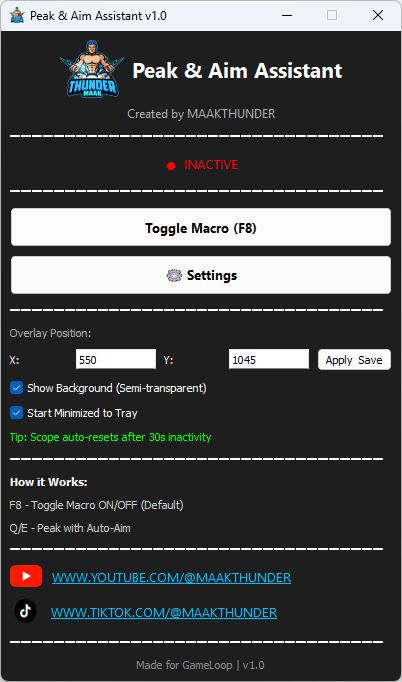
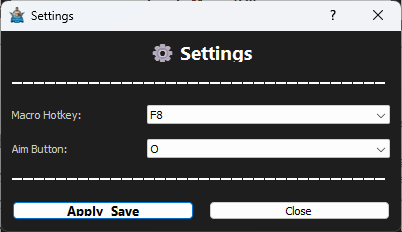
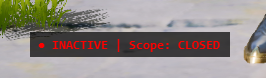

# 🎮 Peak & Aim Assistant

<div align="center">


**Professional gaming assistant for mobile emulators with intelligent aim control and scope detection**

[Features](#-features) • [Installation](#-installation) • [Usage](#-usage) • [Settings](#-settings) • [FAQ](#-faq)

</div>

---

## 📖 Overview

Peak & Aim Assistant is a lightweight, customizable macro tool designed to enhance your gaming experience on GameLoop and other Android emulators. It automatically combines peek and aim actions, with smart scope detection to prevent accidental scope closure.

### 🎯 What It Does

- **Automatic Aim Control**: Holds your aim button when you peek left (Q) or right (E)
- **Smart Scope Detection**: Detects when you're scoped and prevents aim button from closing your scope
- **Auto-Reset Feature**: Scope status automatically resets after 10 seconds of inactivity
- **Fully Customizable**: Choose your own hotkeys and aim button
- **In-Game Overlay**: Real-time status display with customizable position
- **System Tray Integration**: Runs quietly in the background

---

## ✨ Features

### Core Functionality
- ✅ **Peak & Aim Combo** - Press Q or E to automatically hold your aim button
- ✅ **Scope Detection** - Right-click detection (tap to toggle, hold for temporary)
- ✅ **Auto-Recovery** - Watchdog system prevents stuck keys
- ✅ **30-Second Auto-Reset** - Scope status resets automatically if no activity

### Customization
- ✅ **Custom Macro Hotkey** - Choose from 100+ keyboard keys (Default: F8)
- ✅ **Custom Aim Button** - Set any key as your aim button (Default: O)
- ✅ **Overlay Position** - Position the status overlay anywhere on screen
- ✅ **Persistent Settings** - All preferences saved automatically

### User Interface
- ✅ **Modern Dark Theme** - Clean, professional interface
- ✅ **In-Game Overlay** - Shows macro status and scope state
- ✅ **System Tray** - Minimize to tray with quick access menu
- ✅ **Single Instance** - Prevents multiple instances from running

---

## 📸 Screenshots

### Main Interface

*Clean and intuitive main interface*

### Settings Panel

*Customizable hotkeys and buttons*

### In-Game Overlay

*Real-time status display during gameplay*

---

## 🚀 Installation

### Option 1: Download Executable (Recommended)

1. Go to [Releases](../../releases)
2. Download the latest `PeakAimAssistant.exe`
3. Run the executable (no installation needed!)

> **Note**: Windows Defender may show a warning. Click "More info" → "Run anyway"

### Option 2: Run from Source

**Prerequisites:**
- Python 3.8 or higher
- pip (Python package manager)

**Steps:**

```bash
# Clone the repository
git clone https://github.com/MAAKTHUNDER/peak-aim-assistant.git
cd peak-aim-assistant

# Install dependencies
pip install -r requirements.txt

# Run the application
python peak_aim_assistant.py
```

---

## 🎮 Usage

### Quick Start

1. **Launch the application**
   - Run `PeakAimAssistant.exe` or `python peak_aim_assistant.py`

2. **Configure (Optional)**
   - Click **⚙ Settings** to customize hotkeys
   - Set overlay position if needed

3. **Start Gaming**
   - Open your emulator (GameLoop, BlueStacks, etc.)
   - Press **F8** (or your custom hotkey) to enable the macro
   - Use **Q/E** to peek - aim button is automatically pressed!

### Controls

| Action | Default Key | Description |
|--------|-------------|-------------|
| Toggle Macro | `F8` | Enable/disable the macro |
| Peak Left | `Q` | Peek left with auto-aim |
| Peak Right | `E` | Peek right with auto-aim |
| Scope Toggle | `Right-Click (tap)` | Toggle scope mode on/off |
| Scope Hold | `Right-Click (hold)` | Temporary scope mode |

### Overlay Indicators

- 🟢 **ACTIVE** - Macro is running
- 🔴 **INACTIVE** - Macro is off
- **Scope: CLOSED** - Aim button will work with Q/E
- **Scope: OPEN** - Aim button disabled (prevents scope closure)

---

## ⚙️ Settings

### Macro Hotkey
Choose from 100+ keyboard options:
- Function keys (F1-F12)
- Letters (A-Z)
- Numbers (0-9)
- Numpad keys
- Special keys (Insert, Delete, Home, etc.)

### Aim Button
Select which key to use for aiming:
- Any letter (A-Z)
- Numbers (0-9)
- Special keys (Space, Shift, Ctrl, etc.)
- Mouse buttons (Left/Right/Middle Click)

### Overlay Position
- Set custom X, Y coordinates
- Position anywhere on your screen
- Settings persist between sessions

### Additional Options
- ☑️ **Show Background** - Semi-transparent background for overlay
- ☑️ **Start Minimized** - Launch directly to system tray

---

## 🔧 Configuration

Settings are automatically saved in `settings.json`:

```json
{
  "overlay_x": 1600,
  "overlay_y": 50,
  "overlay_bg": true,
  "start_minimized": false,
  "macro_hotkey": "F8",
  "aim_button": "O"
}
```

---

## 💡 Tips & Tricks

### Optimal Settings
- Position overlay in top-right corner for visibility
- Use F8 for quick toggle (easy to reach)
- Set aim button to match your in-game settings

### Scope Detection
- **Quick tap** (< 300ms) = Toggle scope on/off
- **Long hold** (≥ 300ms) = Temporary scope mode
- Auto-resets after 10 seconds if no right-click activity

### Performance
- Minimal CPU usage (~0.3-0.5%)
- Low memory footprint (~50-80 MB)
- No impact on game performance

---

## 🛠️ Building from Source

### Create Executable

```bash
# Install PyInstaller
pip install pyinstaller

# Build standalone executable
pyinstaller --onefile --windowed --icon=icon.ico --add-data "logo.png;." --add-data "youtube.png;." --add-data "tiktok.png;." --add-data "icon.ico;." --name=PeakAimAssistant peak_aim_assistant.py

# Executable will be in dist/ folder
```

---

## 🤝 Contributing

Contributions are welcome! Here's how you can help:

1. Fork the repository
2. Create a feature branch (`git checkout -b feature/AmazingFeature`)
3. Commit your changes (`git commit -m 'Add some AmazingFeature'`)
4. Push to the branch (`git push origin feature/AmazingFeature`)
5. Open a Pull Request

---

## 📋 Requirements

### System Requirements
- **OS**: Windows 10/11
- **RAM**: 100 MB minimum
- **Python**: 3.8+ (for source installation)

### Python Dependencies
```
PyQt5>=5.15.0
keyboard>=0.13.5
pynput>=1.7.6
pywin32>=305
```

---

## 🐛 Troubleshooting

### Common Issues

**Q: Macro doesn't activate**
- Ensure F8 is pressed (overlay shows "ACTIVE")
- Check if scope is accidentally toggled ON
- Try running as administrator

**Q: Overlay not visible**
- Check X, Y coordinates are within screen bounds
- Verify overlay background is enabled
- Restart the application

**Q: Keys getting stuck**
- Press F8 to disable macro
- Restart the application
- Watchdog should auto-recover

**Q: "Already Running" message**
- Close the existing instance from system tray
- Check Task Manager for running processes

---

## ⚠️ Disclaimer

This tool is created for **educational and accessibility purposes only**. 

- Use at your own risk
- Check your game's Terms of Service before use
- The developers are not responsible for any consequences
- Intended for quality of life improvements, not unfair advantages

---

## 📝 Changelog

### v1.0.0 (2026-02-01)
- ✨ Initial release
- ✅ Peak & Aim combination
- ✅ Scope detection with auto-reset
- ✅ Customizable hotkeys
- ✅ In-game overlay
- ✅ System tray integration
- ✅ Persistent settings

---

## 🙏 Acknowledgments

- Built with Python and PyQt5
- Icons and assets from various sources
- Inspired by the gaming community's needs
- Special thanks to all testers and contributors

---

## 📞 Support

### Get Help
- 📧 **Issues**: [GitHub Issues](../../issues)
- 💬 **Discussions**: [GitHub Discussions](../../discussions)

### Connect with Creator
- 🎥 **YouTube**: [MAAKTHUNDER](https://www.youtube.com/@MAAKTHUNDER)
- 🎵 **TikTok**: [@maakthunder](https://www.tiktok.com/@maakthunder)

---

## 📄 License

This project is licensed under the MIT License - see the [LICENSE](LICENSE) file for details.

---

## ⭐ Show Your Support

If you find this project helpful, please consider:
- ⭐ Starring the repository
- 🍴 Forking for your own use
- 📢 Sharing with friends
- 💖 Subscribing to [MAAKTHUNDER's YouTube](https://www.youtube.com/@MAAKTHUNDER)

---

<div align="center">

**Made with ❤️ by [MAAKTHUNDER](https://www.youtube.com/@MAAKTHUNDER)**

*For GameLoop and mobile emulator enthusiasts*

</div>
